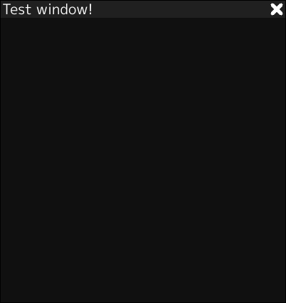

# EbitUI
A simple [retained-mode](https://en.wikipedia.org/wiki/Retained_mode) UI library written in [Go](https://go.dev/) for [Ebitengine](https://ebitengine.org/)

(with draw caching!)

## Extremely early development. Don't use this for anything.
I warned you ;)

## TO DO: Almost everything!
### Completed:
Draw a window, with a title and a close X

Make window draggable

Screenshot:

Example is in the 'Example' directory.

(click launch package in vscode)

## EbitUI.Start(width, height)
Init EbitUI

## Window IDs (string)
These can be whatever you like, but they are converted to lowercase.

## EbitUI.DrawWindows(screen)
Render windows to the screen. Use this in Draw() at the end.

## EbitUI.AddWindow("window id", windowData)
Adds a window called "window id" to the window list

## EbitUI.DeleteWindow("window id")
Deletes a window called "window id" from the window list (if found)

## EbitUI.OpenWindow("window id")
Opens the window "window id" (if found)

## EbitUI.CloseWindow("window id")
Closes the window "window id" (if found)

## EbitUI.UpdateViewerSize(width, height) (width, height)
Updates the viewer size. This will prevent windows from going off the screen and will resize maximized windows

Keeps window from resized to extremely small sizes (return value)
