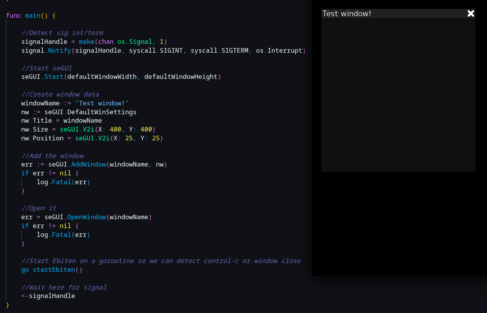

# seGUI

A simple UI library written in [Go](https://go.dev/) for [Ebitengine](https://ebitengine.org/).

## Development is just begining. Don't use this unless you are insane.
## TO DO: Pretty much the whole thing.

## seGUI.Start()

Init seGUI

## Window IDs (string)

These can be whatever you like, but they are converted to lowercase.

One reserved name is "hud" and will already exist.

## seGUI.DrawWindows(screen)

Render windows to the screen. Use this in Draw() at the end.

## seGUI.AddWindow("window id", windowData)

Adds a window called "window id" to the window list

## seGUI.DeleteWindow("window id")

Deletes a window called "window id" from the window list (if found)

## seGUI.OpenWindow("window id")

Opens the window "window id" (if found)

## seGUI.CloseWindow("window id")

Closes the window "window id" (if found)

## seGUI.UpdateViewerSize(width, height int)

Updates the viewer size. This will prevent windows from going off the screen and will resize the hud.